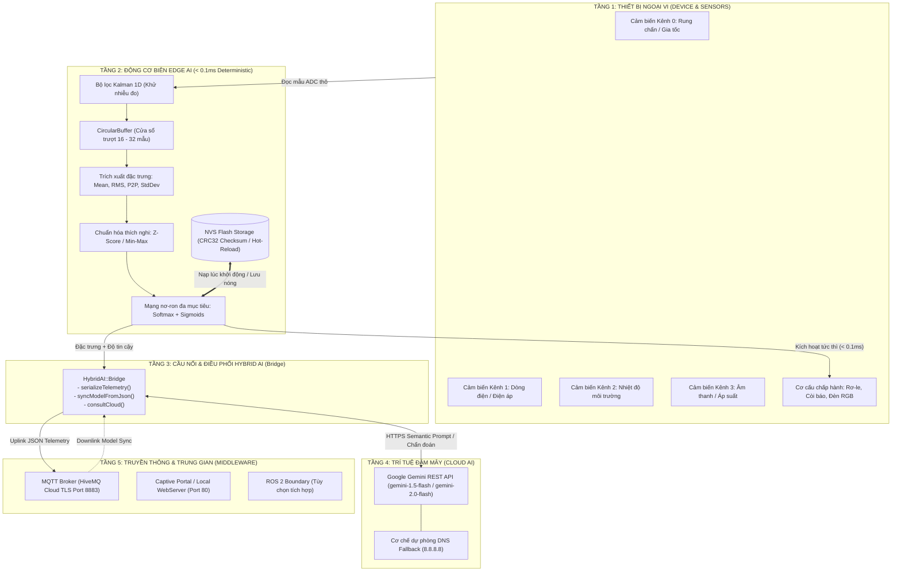
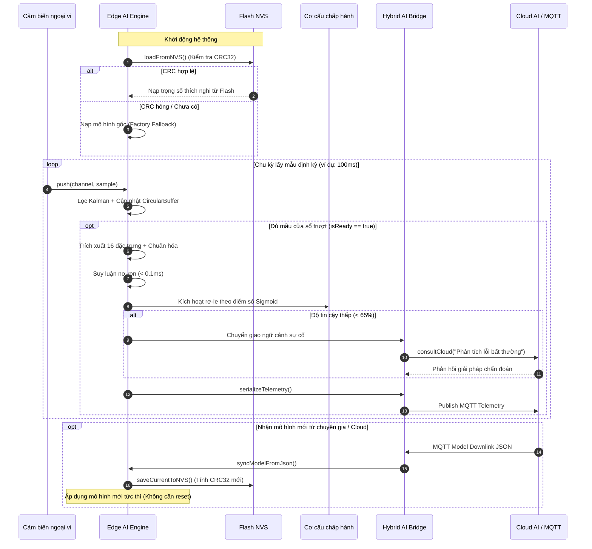

# Kiến Trúc Hybrid AI v2.0 (AIoT_LIB)

Tài liệu đặc tả kiến trúc tổng thể của hệ thống **Hybrid AI v2.0** trên nền tảng vi điều khiển ESP32 (ESP32 Classic / ESP32-S3 / ESP32-C3) tích hợp điện toán đám mây.

---

## 1. Giới Thiệu & Triết Lý Cốt Lõi

Trong các hệ thống công nghiệp và IoT thông minh, bài toán xử lý trí tuệ nhân tạo luôn đối mặt với sự đánh đổi (trade-off) giữa **tốc độ phản ứng** và **khả năng suy luận ngữ nghĩa**:

| Đặc tính | Edge AI (Tại Biên) | Cloud AI (Đám Mây) |
| :--- | :--- | :--- |
| **Độ trễ** | Siêu thấp ($< 0.1\text{ ms}$) | Độ trễ mạng ($1 - 3\text{ s}$) |
| **Kết nối mạng** | Hoạt động độc lập 100% offline | Bắt buộc có Internet |
| **Độ tin cậy** | Thời gian thực tất định (Deterministic) | Phụ thuộc đường truyền và quota API |
| **Năng lực tính toán** | Phân loại số học, ngưỡng kích hoạt | Suy luận ngữ nghĩa, chẩn đoán sâu |
| **Khả năng thích nghi** | Nạp lại trọng số qua NVS Flash | Học tăng cường, mô hình nền tảng lớn |

### Triết lý "Tách rời Cơ chế khỏi Chính sách" (Mechanism vs. Policy)
Hệ thống tuân thủ nghiêm ngặt nguyên lý thiết kế:
- **Cơ chế (Mechanism):** Thư viện cung cấp toàn bộ đường ống (pipeline) toán học, bộ lọc nhiễu, mạng nơ-ron đa nhiệm, nạp/lưu bộ nhớ Flash NVS, giao tiếp TLS và client gọi Gemini.
- **Chính sách (Policy):** Người phát triển ứng dụng toàn quyền quyết định khi nào gửi dữ liệu lên mây, khi nào kích hoạt rơ-le, và ngưỡng tin cậy để chuyển giao quyền quyết định.

---

## 2. Sơ Đồ Kiến Trúc Hệ Thống (System Architecture)



---

## 3. Chi Tiết Các Tầng Chức Năng

### 3.1. Tầng 1: Device HAL (Hardware Abstraction Layer)
- **ActuatorManager:** Quản lý danh sách rơ-le định danh động, hỗ trợ còi báo non-blocking (`tickBuzzer()` chống treo CPU và an toàn với hiện tượng tràn `millis()`).
- **SensorManager:** Đọc đa kênh tương tự (ADC) và số (GPIO), hỗ trợ tự động bù sai số.

### 3.2. Tầng 2: Edge AI Pipeline & Math Engine
Đường ống toán học thời gian thực tối ưu hóa phần cứng FPU của ESP32:

1. **Khử nhiễu đo (Kalman Filter 1D):**
   $$x_k = x_{k-1}, \quad P_k = P_{k-1} + Q$$
   $$K = \frac{P_k}{P_k + R}, \quad \hat{x} = x_k + K(z_k - x_k), \quad P = (1 - K)P_k$$
   Lọc tín hiệu rung chấn, loại bỏ nhiễu điện từ tần số cao.

2. **Cửa sổ trượt (Circular Buffer):**
   Tích lũy 16 đến 32 mẫu trên từng kênh với độ phức tạp không gian $O(1)$, không cấp phát động.

3. **Trích xuất 16 đặc trưng vật lý (Feature Extraction):**
   - **Mean:** $\mu = \frac{1}{N}\sum x_i$
   - **RMS (Root Mean Square):** $\text{RMS} = \sqrt{\frac{1}{N}\sum x_i^2}$
   - **Peak-to-Peak (P2P):** $\max(x) - \min(x)$
   - **Standard Deviation:** $\sigma = \sqrt{\frac{1}{N}\sum (x_i - \mu)^2}$

4. **Chốt chặn an toàn toán học (Numerical Stability Guards):**
   - **Lọc NaN/Inf:** Tự động thay thế giá trị sai lệch bằng 0.0f.
   - **Bảo vệ căn bậc hai:** $\sigma = \sqrt{\max(0.0f, \text{Variance})}$ triệt tiêu lỗi số học số âm.
   - **Kẹp biên Sigmoid (Clamped Sigmoid):** Giới hạn $z \in [-40.0, +40.0]$ nhằm ngăn tràn số hàm số mũ `expf()`.
   - **Ổn định số học Softmax:** Trừ max logit $z'_i = z_i - \max(z)$ trước khi tính $\exp$, cộng epsilon $\epsilon = 10^{-7}$ ở mẫu số chống chia cho 0.

5. **Bộ nhớ thích nghi NVS Flash:**
   - Lưu trữ toàn bộ ma trận trọng số $W$, vector bias $b$, và tham số chuẩn hóa.
   - Kiểm tra tính toàn vẹn bằng mã băm **CRC32**. Khi dữ liệu hỏng hoặc Flash chưa có, hệ thống tự động fallback về cấu hình mặc định (Factory Model).

### 3.3. Tầng 3: Cầu Nối Hybrid AI (Bridge)
- Đóng vai trò là trung gian trao đổi thông tin giữa Edge AI và Cloud AI mà không áp đặt chính sách:
  - **Uplink:** Chuyển đổi trạng thái Edge AI thành JSON tiêu chuẩn.
  - **Downlink:** Phân tích JSON trọng số mới và nạp trực tiếp vào NVS Flash mà không cần biên dịch lại firmware.
  - **Edge-Cloud Fallback:** Khi Edge AI phát hiện độ tin cậy rơi xuống thấp ($\text{confidence} < \text{threshold}$), Bridge kích hoạt truy vấn Cloud để chẩn đoán chuyên sâu.

### 3.4. Tầng 4: Trí Tuệ Đám Mây (Cloud AI)
- Sử dụng Google Gemini REST API qua kết nối HTTPS bảo mật (TLS 1.2/1.3).
- Tích hợp hệ thống phân giải tên miền dự phòng **DNS Fallback (8.8.8.8)** phòng khi router mạng bị lỗi DNS.
- Tự động phát hiện lỗi giới hạn lưu lượng (HTTP 429) và timeout mạng (10.000 ms).

### 3.5. Tầng 5: Middleware & Giao Thức Truyền Thông
- **MQTT over TLS (Port 8883):** Kết nối an toàn đến HiveMQ Cloud hoặc broker công nghiệp.
- **Captive Portal:** Chế độ Access Point nội bộ cấu hình SSID/Password qua giao diện Web cổng 80 khi mất kết nối mạng.
- **Biên tích hợp ROS 2 (Boundary):** Thiết kế mô-đun hóa cho phép kết nối với hệ điều hành robot ROS 2 qua micro-ROS hoặc bridge serial mà không gây phụ thuộc ngược vào nhân thư viện.

---

## 4. Chuẩn Giao Thức Dữ Liệu (Data Contracts)

### 4.1. Bản tin Telemetry Uplink (ESP32 $\rightarrow$ MQTT / Cloud)
Được sinh tự động bởi hàm `serializeTelemetry(mac)`:
```json
{
  "mac": "24:6F:28:XX:XX:XX",
  "winner_label": 0,
  "confidence": 0.945,
  "norm_type": "Z_SCORE",
  "from_nvs": true,
  "latency_us": 48,
  "cmd_scores": [0.62, 0.15, 0.0, 0.0],
  "features": [
    25.2, 26.4, 5.1, 1.3,
    10.1, 10.6, 2.1, 0.5,
    46.0, 46.2, 3.2, 0.8,
    52.0, 53.1, 6.2, 1.6
  ]
}
```

### 4.2. Bản tin Đồng Bộ Mô Hình Downlink (Cloud $\rightarrow$ ESP32 Flash NVS)
Được giải mã và lưu nóng vào NVS Flash bởi hàm `syncModelFromJson(payload)`:
```json
{
  "input_dim": 16,
  "num_labels": 3,
  "num_cmds": 2,
  "norm_type": 2,
  "W": [-0.5, -0.6, 0.12, 0.45, ...],
  "b": [0.5, -0.2, -1.0, -0.6, -1.5],
  "norm1": [25.0, 26.0, 5.0, 1.2, ...],
  "norm2": [4.5, 4.8, 1.5, 0.4, ...]
}
```
*Ghi chú: `norm_type`: 0 = NONE, 1 = MIN_MAX, 2 = Z_SCORE. `norm1` là min hoặc mean; `norm2` là max hoặc stddev.*

---

## 5. Quy Trình Vận Hành (Operational Workflow)



---

## 6. Tiêu Chuẩn Bộ Nhớ & Hiệu Năng

| Chỉ số | Giá trị đo lường | Ghi chú |
| :--- | :--- | :--- |
| **Thời gian suy luận biên** | **$45 - 65\ \mu\text{s}$** | ESP32 @ 240 MHz (Single Core FPU) |
| **Dung lượng Flash chiếm dụng** | **~970 KB** | Đã bao gồm mbedTLS, WiFi, WebServer, Edge AI |
| **Dung lượng RAM tĩnh** | **~54 KB** | Tối ưu không gian Stack, loại bỏ hoàn toàn VLA |
| **Tuổi thọ bộ nhớ Flash** | **Tối ưu hóa** | Chỉ ghi khi có cập nhật trọng số mới từ Cloud |
| **Độ trễ phản ứng an toàn** | **Tức thì ($< 1\text{ ms}$)** | Cắt nguồn khẩn cấp qua GPIO trực tiếp |

---

## 7. Công Cụ Hỗ Trợ Kèm Theo

1. **Huấn luyện ngoại tuyến (`tools/Edge_ai_train.py`):**
   - Tự động sinh mã mảng C++ (`W`, `b`, `meanVals`, `stdDevVals`) hoặc sinh file JSON Downlink để cập nhật từ xa.
2. **Kiểm thử đơn vị tự động (`test/test_ai_core/test_main.cpp`):**
   - Kiểm tra độc lập bộ lọc Kalman, trích xuất đặc trưng, chốt chặn số học (NaN, Inf, Overflow) và mạng nơ-ron đa nhiệm.
