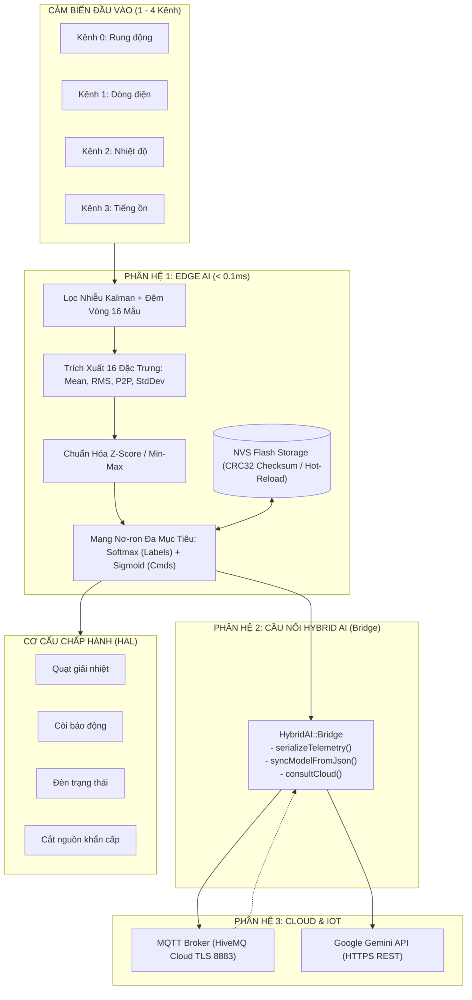

# Thư Viện AIoT (AIoT_LIB)

<p align="center">
  <b>Framework AIoT Mã Nguồn Mở Hiệu Năng Cao Cho Các Dòng Vi Điều Khiển ESP32 (ESP32 Classic / ESP32-S3) & Cloud AI</b>
</p>

<p align="center">
  
  
  
  
  
  
</p>

---

## Mục Lục

1. [Giới Thiệu & Triết Lý Thiết Kế](#1-giới-thiệu--triết-lý-thiết-kế)
2. [Kiến Trúc 4 Phân Hệ Cốt Lõi (Architecture)](#2-kiến-trúc-4-phân-hệ-cốt-lõi)
   - [Phân hệ 1: Device HAL & IoT Core (`AIoT.device`)](#phân-hệ-1-device-hal--iot-core-aiotdevice)
   - [Phân hệ 2: Toàn trình Edge AI & NVS Flash (`AIoT.edgeAI`)](#phân-hệ-2-toàn-trình-edge-ai--nvs-flash-aiotedgeai)
   - [Phân hệ 3: Trí Tuệ Đám Mây (`AIoT.cloudAI`)](#phân-hệ-3-trí-tuệ-đám-mây-aiotcloudai)
   - [Phân hệ 4: Cầu Nối Điện Toán Lai (`AIoT.hybridAI`)](#phân-hệ-4-cầu-nối-điện-toán-lai-aiothybridai)
3. [Quy Chuẩn Dữ Liệu 2 Chiều (Data Contracts)](#3-quy-chuẩn-dữ-liệu-2-chiều-data-contracts)
4. [Hướng Dẫn Bộ Ví Dụ Mẫu (Examples Guide)](#4-hướng-dẫn-bộ-ví-dụ-mẫu-examples-guide)
5. [Cẩm Nang Tra Cứu API Đầy Đủ (API Reference)](#5-cẩm-nang-tra-cứu-api-đầy-đủ-api-reference)
6. [Tác Quyền & Giấy Phép (License)](#6-tác-quyền--giấy-phép-license)

---

## 1. Giới Thiệu & Triết Lý Thiết Kế

Trong các hệ thống công nghiệp hiện đại, việc ứng dụng AI đối mặt với hai thách thức:
- **Xử lý tại biên (Edge AI)** đòi hỏi tốc độ siêu nhanh ($< 0.1\text{ms}$) để ngắt máy bảo vệ an toàn khi có sự cố, nhưng tài nguyên RAM/Flash trên chip bị giới hạn và không thể tự phân tích chẩn đoán ngữ nghĩa phức tạp.
- **Xử lý đám mây (Cloud AI - Google Gemini)** có năng lực tư duy, chẩn đoán sâu và hỗ trợ đa ngôn ngữ, nhưng lại có độ trễ mạng ($1 - 3\text{s}$) và phụ thuộc vào kết nối Internet.

**AIoT_LIB** giải quyết triệt để bài toán này theo triết lý:
> **"Tách rời Cơ chế khỏi Chính sách (Separate Mechanism from Policy)"**  
> *Thư viện chỉ cung cấp các công cụ (Mechanism) mạnh mẽ, chuẩn hóa và tối ưu nhất; người dùng toàn quyền quyết định tình huống (Policy) vận hành trong mã nguồn ứng dụng.*

Thư viện tương thích **100% với cả ESP32 thường (WROOM-32, NodeMCU ESP32) lẫn ESP32-S3 / ESP32-C3**, không phụ thuộc thư viện ngoài, tối ưu RAM chỉ tốn **~54 KB** và Flash **~970 KB**.

---

## 2. Kiến Trúc 4 Phân Hệ Cốt Lõi



### Phân hệ 1: Device HAL & IoT Core (`AIoT.device`)
- Quản lý chân động (Dynamic Pin Mapping), đăng ký Rơ-le, còi hú, đèn LED bằng nhãn văn bản.
- Tích hợp Captive Portal phục vụ cấu hình WiFi & MQTT nội bộ qua cổng 80 khi thiết bị mất mạng.
- Giao tiếp bảo mật hai chiều qua HiveMQ Cloud TLS Port 8883.

### Phân hệ 2: Toàn trình Edge AI & NVS Flash (`AIoT.edgeAI`)
- **Giai đoạn 1 (Lọc & Đệm):** Bộ lọc Kalman 1D khử nhiễu đo kết hợp bộ đệm vòng `CircularBuffer` lưu trữ cửa sổ trượt 16 đến 32 mẫu.
- **Giai đoạn 2 (Trích xuất & Chuẩn hóa):** Tính toán 4 chỉ số thống kê vật lý trên từng kênh:
  $$\text{Mean} = \frac{1}{N}\sum x_i, \quad \text{RMS} = \sqrt{\frac{1}{N}\sum x_i^2}, \quad \text{P2P} = \max(x) - \min(x), \quad \text{StdDev} = \sqrt{\frac{1}{N}\sum(x_i - \mu)^2}$$
  Hỗ trợ chuẩn hóa Z-Score $z = \frac{x - \mu}{\sigma}$ và Min-Max $x' = \frac{x - \min}{\max - \min}$.
- **Giai đoạn 3 (Mạng nơ-ron đa mục tiêu):** Thực thi đồng thời phân loại nhãn loại trừ qua **Softmax** và tính điểm số độc lập cho từng cơ cấu chấp hành qua **Sigmoid**.
- **Giai đoạn 4 (Kho lưu trữ thích nghi NVS Flash):** Tự động băm CRC32 kiểm tra toàn vẹn, hỗ trợ nạp mô hình thích nghi từ Flash, nạp nóng không cần khởi động lại, và fallback an toàn về cấu hình xuất xưởng.

### Phân hệ 3: Trí Tuệ Đám Mây (`AIoT.cloudAI`)
- Module `GeminiClient` gọi trực tiếp Google Gemini qua HTTPS (`gemini-1.5-flash`, `gemini-2.0-flash`).
- Tự động kích hoạt DNS Fallback (8.8.8.8), chống lỗi kết nối và quản lý hạn mức quota 429.
- Cho phép trò chuyện tự do hoặc nhận prompt chẩn đoán kỹ thuật.

### Phân hệ 4: Cầu Nối Điện Toán Lai (`AIoT.hybridAI`)
- Đóng vai trò là cầu nối dữ liệu hai chiều:
  - **Chiều lên (Uplink):** Tự động đóng gói 16 đặc trưng + nhãn + điểm số thành chuỗi JSON chuẩn.
  - **Chiều xuống (Downlink):** Nhận JSON chứa $W, b$, Z-Score từ Cloud $\rightarrow$ gọi `saveToNVS()` nạp đè vào Flash tức thì.
  - **Chẩn đoán phối hợp:** Tự động kẹp 16 đặc trưng hiện tại vào câu hỏi gửi lên Gemini.

---

## 3. Quy Chuẩn Dữ Liệu 2 Chiều (Data Contracts)

### Bản tin Chiều lên: Telemetry Uplink (ESP32 $\rightarrow$ Cloud / MQTT)
Được sinh tự động bởi hàm `AIoT.hybridAI.serializeTelemetry()`:
```json
{
  "mac": "24:6F:28:XX:XX:XX",
  "winner_label": 0,
  "confidence": 0.945,
  "norm_type": "Z_SCORE",
  "from_nvs": true,
  "latency_us": 48,
  "cmd_scores": [0.62, 0.15, 0.0, 0.0],
  "features": [
    25.2, 26.4, 5.1, 1.3,
    10.1, 10.6, 2.1, 0.5,
    46.0, 46.2, 3.2, 0.8,
    52.0, 53.1, 6.2, 1.6
  ]
}
```

### Bản tin Chiều xuống: Model Downlink (Cloud / Web $\rightarrow$ ESP32 NVS)
Được giải mã và nạp nóng tự động bởi hàm `AIoT.hybridAI.syncModelFromJson()`:
```json
{
  "input_dim": 16,
  "num_labels": 3,
  "num_cmds": 2,
  "norm_type": 2,
  "W": [-0.5, -0.6, ...],
  "b": [0.5, -0.2, -1.0, -0.6, -1.5],
  "norm1": [25.0, 26.0, 5.0, 1.2, 10.0, ...],
  "norm2": [4.5, 4.8, 1.5, 0.4, 2.0, ...]
}
```

---

## 4. Hướng Dẫn Bộ Ví Dụ Mẫu (Examples Guide)

Thư mục `examples/` đi kèm 5 ví dụ thực tế có thể nạp chạy ngay:

### [1. `01_Basic_IoT.ino`](examples/01_Basic_IoT/01_Basic_IoT.ino)
- **Mục đích:** Làm quen với phần cứng HAL và gửi telemetry cơ bản.
- **Tính năng:** Đăng ký rơ-le qua `AIoT.device.attachRelay()`, bật/tắt rơ-le, đọc cảm biến và gửi lên MQTT qua `AIoT.updateTelemetry()`.

### [2. `02_Edge_AI_Pipeline.ino`](examples/02_Edge_AI_Pipeline/02_Edge_AI_Pipeline.ino)
- **Mục đích:** Toàn trình thu thập, lọc và suy luận Edge AI 4 kênh cảm biến.
- **Tính năng:** 4 kênh đầu vào ADC, lọc Kalman, trích xuất 16 đặc trưng, chuẩn hóa Z-Score, phân loại 3 trạng thái (`NORMAL`, `WARNING`, `FAULT`) và điều khiển độc lập 2 rơ-le qua Sigmoid (`Quạt`, `Còi`).

### [3. `03_Edge_AI_Adaptive_NVS.ino`](examples/03_Edge_AI_Adaptive_NVS/03_Edge_AI_Adaptive_NVS.ino)
- **Mục đích:** Thử nghiệm quản lý mô hình thích nghi trên NVS Flash.
- **Tính năng:** Khởi động 2 tầng (load từ NVS Flash trước, fallback về mô hình mặc định), tương tác Serial Monitor với các phím lệnh `'s'` (Lưu NVS), `'c'` (Xóa trắng Flash/Factory Reset), `'l'` (Nạp lại Flash), `'p'` (In tóm tắt suy luận).

### [4. `04_Cloud_AI_Gemini.ino`](examples/04_Cloud_AI_Gemini/04_Cloud_AI_Gemini.ino)
- **Mục đích:** Kết nối trực tiếp Google Gemini API qua HTTPS từ ESP32.
- **Tính năng:** Cấu hình API Key, gửi câu hỏi tự do qua Serial Monitor và nhận phản hồi phân tích dạng text từ Gemini.

### [5. `05_Hybrid_AI_Full_System.ino`](examples/05_Hybrid_AI_Full_System/05_Hybrid_AI_Full_System.ino)
- **Mục đích:** Mô hình hoàn chỉnh kết hợp cả Edge AI, Cloud AI và Hybrid AI.
- **Tính năng:** Chạy Edge AI tại biên, tự động đóng gói 16 đặc trưng gửi lên Cloud; khi độ tự tin rớt dưới 65% tự động gọi `consultCloud()` xin chẩn đoán từ Gemini; khi nhận bản tin JSON qua MQTT tự động nạp đè vào NVS Flash qua `syncModelFromJson()`.

---

## 5. Cẩm Nang Tra Cứu API Đầy Đủ (API Reference)

Tất cả các tính năng đều được truy cập thông qua đối tượng toàn cục duy nhất **`AIoT`**:

### Nhóm 1: Quản lý Thiết bị Ngoại Vi (`AIoT.device.*`)
```cpp
AIoT.device.begin();                                     // Khởi động HAL
AIoT.device.attachRelay(pin, "Tên");                     // Gắn Rơ-le vào chân GPIO
AIoT.device.Relay(pin).on();                             // Bật Rơ-le
AIoT.device.Relay(pin).off();                            // Tắt Rơ-le
bool state = AIoT.device.Relay(pin).getState();          // Lấy trạng thái hiện tại
```

### Nhóm 2: Lõi Suy Luận Edge AI (`AIoT.edgeAI.*`)
```cpp
AIoT.edgeAI.begin(windowSize, numChannels);              // Khởi tạo (vd: cửa sổ 16, 4 kênh)
AIoT.edgeAI.setModel(W, b, inputDim, numLabels, numCmds);// Nạp mô hình gốc từ mã nguồn
AIoT.edgeAI.setZScore(meanVals, stdDevVals);             // Chuẩn hóa Z-Score
AIoT.edgeAI.setNormalization(minVals, maxVals);          // Chuẩn hóa Min-Max
float clean = AIoT.edgeAI.push(channel, rawSample);      // Lọc Kalman và nạp mẫu vào đệm
bool ready = AIoT.edgeAI.isReady();                      // Đã tích lũy đủ số mẫu cửa sổ trượt chưa?

size_t label = AIoT.edgeAI.predict();                    // Thực thi suy luận (trả về Argmax nhãn thắng)
float conf = AIoT.edgeAI.getWinnerConfidence();          // Xác suất nhãn thắng (0.0 .. 1.0)
float score = AIoT.edgeAI.getCmdScore(cmdIndex);         // Điểm số xác suất Sigmoid lệnh chỉ định (0.0 .. 1.0)
uint32_t us = AIoT.edgeAI.getExecutionTime();            // Thời gian chip thực thi suy luận (micro-giây)
const float* feats = AIoT.edgeAI.getRawFeatures();       // Mảng chứa các giá trị đặc trưng thô
AIoT.edgeAI.printSummary();                              // In bảng tóm tắt kết quả ra Serial
```

### Nhóm 3: Lưu Trữ Thích Nghi NVS Flash (`AIoT.edgeAI.*`)
```cpp
bool ok = AIoT.edgeAI.loadFromNVS();                     // Đọc và nạp mô hình từ NVS Flash (kiểm tra CRC)
bool saved = AIoT.edgeAI.saveCurrentToNVS();             // Lưu cấu hình đang chạy xuống Flash NVS
AIoT.edgeAI.clearNVS();                                  // Xóa trắng NVS (Khôi phục cài đặt gốc)
bool fromFlash = AIoT.edgeAI.isLoadedFromNVS();          // true nếu mô hình được nạp từ Flash
const char* norm = AIoT.edgeAI.getNormTypeName();        // Trả về "Z_SCORE", "MIN_MAX" hoặc "NONE"
```

### Nhóm 4: Trí Tuệ Đám Mây Gemini (`AIoT.cloudAI.*`)
```cpp
AIoT.cloudAI.begin(apiKey, "gemini-1.5-flash");          // Khởi tạo API Key và Model
String reply = AIoT.cloudAI.ask(prompt, sysInstruction); // Gửi câu hỏi lên Gemini qua HTTPS
```

### Nhóm 5: Cầu Nối Điện Toán Lai (`AIoT.hybridAI.*`)
```cpp
String json = AIoT.hybridAI.serializeTelemetry(mac);     // Đóng gói 16 đặc trưng + nhãn thành JSON
bool synced = AIoT.hybridAI.syncModelFromJson(jsonStr);  // Giải mã JSON trọng số mới và nạp thẳng vào NVS
String diag = AIoT.hybridAI.consultCloud("Câu hỏi");     // Tự động gom 16 đặc trưng gửi Gemini chẩn đoán
```

---

## 6. Tác Quyền & Giấy Phép (License)

Dự án được phát triển bởi **Thắng Nguyễn** và phát hành dưới giấy phép **GNU General Public License v3.0 (GPLv3)**.
Mọi người có quyền tự do sử dụng, nghiên cứu, sửa đổi và đóng góp mã nguồn cho cộng đồng.
Chi tiết xem tại file [LICENSE](LICENSE).