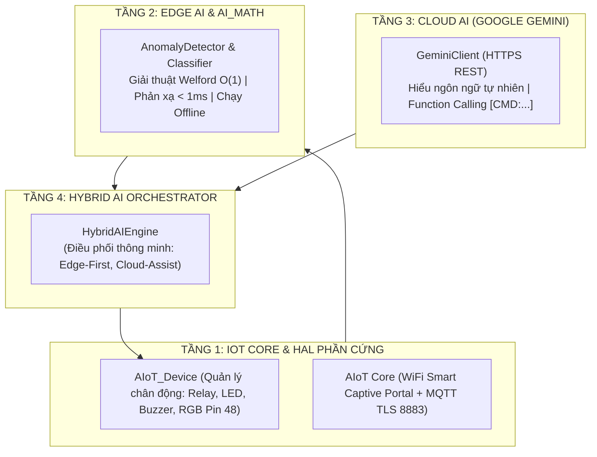

# Thư Viện AIoT (AIoT_LIB)

<p align="center">
  <b>Framework AIoT Mã Nguồn Mở Hiệu Năng Cao Cho Các Dòng Vi Điều Khiển ESP32 & Đa Nền Tảng Cloud / AI</b>
</p>

<p align="center">
  
  
  
  
  
  
</p>

---

## Mục Lục

1. [Giới Thiệu & Triết Lý Thiết Kế (Introduction & Philosophy)](#1-giới-thiệu--triết-lý-thiết-kế-introduction--philosophy)
2. [Các Ứng Dụng Thực Tế Tiêu Biểu (Real-World Applications)](#2-các-ứng-dụng-thực-tế-tiêu-biểu-real-world-applications)
   - [2.1. Công Nghiệp 4.0 & Bảo Trì Dự Đoán](#21-công-nghiệp-40--bảo-trì-dự-đoán-predictive-maintenance)
   - [2.2. Nhà Thông Minh Trò Chuyện & Điều Khiển Tự Nhiên](#22-nhà-thông-minh-trò-chuyện--điều-khiển-tự-nhiên-smart-home--assistant)
   - [2.3. Nông Nghiệp Công Nghệ Cao](#23-nông-nghiệp-công-nghệ-cao-smart-agriculture)
   - [2.4. Quản Lý Năng Lượng & Lưới Điện Thông Minh](#24-quản-lý-năng-lượng--lưới-điện-thông-minh-smart-energy--grid)
   - [2.5. Robot Di Động & Hệ Thống Tự Hành](#25-robot-di-động--hệ-thống-tự-hành-autonomous-edge-robotics)
3. [Kiến Trúc 4 Tầng & Nguyên Lý Vận Hành (Architecture)](#3-kiến-trúc-4-tầng--nguyên-lý-vận-hành-architecture)
   - [Tầng 1: IoT Core & Trừu Tượng Hóa Thiết Bị Ngoại Vi (HAL)](#tầng-1-iot-core--trừu-tượng-hóa-thiết-bị-ngoại-vi-hal)
   - [Tầng 2: AI Toán Học & Trí Tuệ Nhân Tạo Tại Biên (Edge AI)](#tầng-2-ai-toán-học--trí-tuệ-nhân-tạo-tại-biên-edge-ai)
   - [Tầng 3: Trí Tuệ Nhân Tạo Đám Mây (Cloud AI - Google Gemini)](#tầng-3-trí-tuệ-nhân-tạo-đám-mây-cloud-ai---google-gemini)
   - [Tầng 4: Hệ Thống Điện Toán Lai (Hybrid AI Orchestration)](#tầng-4-hệ-thống-điện-toán-lai-hybrid-ai-orchestration)
4. [Hướng Dẫn Các Ví Dụ Mẫu Theo Từng Tầng (Layer-by-Layer Examples Guide)](#4-hướng-dẫn-các-ví-dụ-mẫu-theo-từng-tầng-layer-by-layer-examples-guide)
   - [Ví Dụ Tầng 1: IoT & Điều Khiển Phần Cứng](#ví-dụ-tầng-1-iot--điều-khiển-phần-cứng)
   - [Ví Dụ Tầng 2: Toán Học Nhúng & AI Tại Biên](#ví-dụ-tầng-2-toán-học-nhúng--ai-tại-biên)
   - [Ví Dụ Tầng 3: Trí Tuệ Đám Mây & Function Calling](#ví-dụ-tầng-3-trí-tuệ-đám-mây--function-calling)
   - [Ví Dụ Tầng 4: Hệ Thống Lai Toàn Diện](#ví-dụ-tầng-4-hệ-thống-lai-toàn-diện)
5. [Hướng Dẫn Bắt Đầu Nhanh Trong 5 Phút (Quickstart)](#5-hướng-dẫn-bắt-đầu-nhanh-trong-5-phút-quickstart)
6. [Bảng Tra Cứu API Tóm Tắt (API Reference)](#6-bảng-tra-cứu-api-tóm-tắt-api-reference)
7. [Tác Quyền & Giấy Phép (License)](#7-tác-quyền--giấy-phép-license)

---

## 1. Giới Thiệu & Triết Lý Thiết Kế (Introduction & Philosophy)

Trong phát triển hệ thống nhúng hiện đại, hai mô hình truyền thống bộc lộ những hạn chế rõ rệt:
- **Hệ thống IoT thuần túy**: Thiết bị chỉ đơn thuần đọc cảm biến và gửi lên máy chủ (Sensor Node), không có năng lực tự suy luận hay phản ứng khi mất mạng.
- **Hệ thống Cloud AI thuần túy**: Phụ thuộc 100% vào kết nối Internet. Khi mạng chập chờn hoặc độ trễ phản hồi từ Cloud lên đến 2-3 giây, các sự cố chập tải hay kẹt động cơ đã có thể gây hư hỏng trước khi nhận được lệnh dừng.

**AIoT_LIB** kết hợp sức mạnh của cả hai nền tảng theo mô hình **Điện toán lai (Hybrid AI Architecture)**:
> *"Phản xạ tức thời tại biên như hệ thần kinh vận động ($< 1\text{ms}$) — Tư duy phân tích sâu trên đám mây như bộ não trung tâm."*

Thư viện được thiết kế tối ưu cho các dòng chip **ESP32 (ESP32-S3, ESP32-C3, ESP32 standard)**, độc lập phần cứng và không phụ thuộc vào bất kỳ thư viện bên ngoài nào cho phần tính toán toán học (Zero-Dependency AI Math).

---

## 2. Các Ứng Dụng Thực Tế Tiêu Biểu (Real-World Applications)

### 2.1. Công Nghiệp 4.0 & Bảo Trì Dự Đoán (Predictive Maintenance)
* **Bài toán**: Động cơ công nghiệp, máy nén khí, bơm thủy lực bị mòn vòng bi, kẹt trục hoặc quá nhiệt dẫn đến cháy nổ.
* **Giải pháp với AIoT_LIB**:
  * **Tầng biên (Edge AI)**: Đọc gia tốc rung chấn qua bộ biến đổi FFT và thuật toán Welford $O(1)$. Nếu phát hiện đột biến $Z\text{-score} > 3.0$, vi điều khiển ngắt Relay bảo vệ máy ngay trong vòng 0.1ms mà không cần Internet.
  * **Tầng đám mây (Cloud AI)**: Đóng gói phổ rung động FFT và lịch sử vận hành gửi lên Google Gemini để chẩn đoán nguyên nhân gốc rễ và đưa ra khuyến nghị bảo trì cho kỹ sư vận hành.

### 2.2. Nhà Thông Minh Trò Chuyện & Điều Khiển Tự Nhiên (Smart Home & Assistant)
* **Bài toán**: Điều khiển thiết bị gia dụng bằng ngôn ngữ tự nhiên tiếng Việt mà không cần nhớ cú pháp câu lệnh cứng nhắc.
* **Giải pháp với AIoT_LIB**:
  * Người dùng nói: *"Trời oi bức quá, bật quạt lên giúp tôi nhé"*.
  * Gemini hiểu ngữ cảnh và chèn tag lệnh an toàn `[CMD:RELAY1_ON]`.
  * ESP32-S3 kiểm tra Whitelist, kích hoạt chân GPIO và phản hồi: *"Tôi đã bật quạt cho bạn rồi nhé!"*.
  * Khi người dùng chào *"xin chào"*, bo mạch tự động nhấp nháy đèn/relay vật lý chào đón (`Greeting_action`).

### 2.3. Nông Nghiệp Công Nghệ Cao (Smart Agriculture)
* **Bài toán**: Ngưỡng độ ẩm đất và nhiệt độ thay đổi liên tục theo mùa và thời tiết, khiến các ngưỡng cố định (hardcoded) dễ gây ngập úng hoặc khô hạn.
* **Giải pháp với AIoT_LIB**:
  * Cục bộ vi điều khiển tự động học mức bình thường (Baseline) theo ngày/đêm bằng Welford online.
  * Tự động kích hoạt van tưới cục bộ khi có bất thường và đồng bộ số liệu qua MQTT TLS 8883 lên HiveMQ Cloud để theo dõi trên điện thoại.

### 2.4. Quản Lý Năng Lượng & Lưới Điện Thông Minh (Smart Energy & Grid)
* **Bài toán**: Giám sát điện năng tiêu thụ, phát hiện hồ quang điện (Arc Fault) và ngắn mạch tức thời.
* **Giải pháp với AIoT_LIB**:
  * Tích hợp giao tiếp Modbus RS485 đọc thông số từ đồng hồ điện đa năng (PZEM-004T, Schneider...).
  * Thuật toán thống kê phát hiện dòng rò hoặc xung đột biến dòng điện để cắt aptomat điện tử bảo vệ đường dây.

### 2.5. Robot Di Động & Hệ Thống Tự Hành (Autonomous Edge Robotics)
* **Bài toán**: Robot thám hiểm hoặc xe tự hành AGV cần xử lý cảm biến va chạm cục bộ siêu tốc trong khi vẫn giữ kết nối điều phối với trung tâm.
* **Giải pháp với AIoT_LIB**:
  * Hỗ trợ tích hợp cầu nối ROS 2 (Robot Operating System).
  * Tự động chuyển sang chế độ dự phòng ngoại tuyến (Offline Fallback) khi robot đi vào khu vực mất sóng WiFi.

---

## 3. Kiến Trúc 4 Tầng & Nguyên Lý Vận Hành (Architecture)



### Tầng 1: IoT Core & Trừu Tượng Hóa Thiết Bị Ngoại Vi (HAL)
- **Độc lập phần cứng (Dynamic Pin Mapping)**: Không gán cố định chân GPIO trong thư viện. Bạn đăng ký chân tự do lúc runtime bằng `AIoT_Device.Relay(pin, "Tên")`.
- **Smart Captive Portal (Web PnP)**: Nếu không có cấu hình WiFi, bo mạch tự phát Access Point `AIoT_WiFi` (IP: `192.168.21.6`) để người dùng quét và cài đặt WiFi ngay trên trình duyệt điện thoại mà không cần nạp lại code.
- **MQTT TLS 8883**: Kết nối bảo mật HiveMQ Cloud Broker và giao tiếp hai chiều qua macro `Virtual_WRITE()`.

### Tầng 2: AI Toán Học & Trí Tuệ Nhân Tạo Tại Biên (Edge AI)
- **Giải thuật Welford $O(1)$**: Cập nhật giá trị trung bình ($\mu$) và phương sai ($\sigma^2$) liên tục theo từng mẫu dữ liệu với bộ nhớ tiêu thụ dưới 100 bytes RAM.
- **Phát hiện bất thường (Anomaly Detection)**: So sánh giá trị cảm biến với phân phối chuẩn qua độ lệch $Z\text{-score}$. Nếu vượt ngưỡng an toàn ($|Z| > 3.0$), vi điều khiển kích hoạt cơ chế bảo vệ máy ngay tức khắc ($< 1\text{ms}$).

### Tầng 3: Trí Tuệ Nhân Tạo Đám Mây (Cloud AI - Google Gemini)
- **Function Calling qua Tag Injection**: AI không bao giờ điều khiển trực tiếp phần cứng. Gemini chỉ phản hồi văn bản kèm các thẻ lệnh như `[CMD:RELAY1_ON]`.
- **Bộ phân giải lệnh an toàn (Whitelist Command Parser)**: ESP32-S3 nhận chuỗi phản hồi, quét các tag `[CMD:...]`, kiểm tra trong danh mục cho phép rồi mới kích hoạt điện áp GPIO.
- **Chống ảo giác cảm biến (Anti-Hallucination)**: System Prompt quy định nghiêm ngặt cấm AI tự ý bịa ra số liệu nhiệt độ, độ ẩm khi hệ thống chưa kết nối cảm biến.

### Tầng 4: Hệ Thống Điện Toán Lai (Hybrid AI Orchestration)
- Tích hợp cả Edge AI và Cloud AI dưới sự điều phối của `PolicyEngine`.
- Bình thường: Edge AI giám sát liên tục, không tiêu tốn token và băng thông Cloud.
- Khi có sự cố hoặc câu hỏi phức tạp: Tự động đánh thức Gemini phân tích và đưa ra giải pháp kỹ thuật.

---

## 4. Hướng Dẫn Các Ví Dụ Mẫu Theo Từng Tầng (Layer-by-Layer Examples Guide)

Tất cả 10 ví dụ trong thư mục `examples/` được phân bổ tương ứng với 4 tầng kiến trúc:

### Ví Dụ Tầng 1: IoT & Điều Khiển Phần Cứng

#### 1. Ví dụ `01_Basic_IoT`
- **Mục tiêu**: Làm quen với vòng đời chương trình `AIoT`, kết nối WiFi, Broker MQTT HiveMQ Cloud TLS (Port 8883) và nhận lệnh từ Dashboard.
- **Điểm sáng**: Lắng nghe sự kiện điều khiển từ xa qua macro `Virtual_WRITE(relay1)` và gửi phản hồi trạng thái ngược lại Server bằng `AIoT.writeControl()`.
- **Ứng dụng**: Nền tảng cho các thiết bị điều khiển từ xa qua Internet.

#### 2. Ví dụ `01_Telemetry_Stream`
- **Mục tiêu**: Thu thập các chỉ số vận hành (Nhiệt độ chip, RAM trống, cường độ sóng WiFi RSSI, thời gian hoạt động) và gửi lên Cloud.
- **Điểm sáng**: Đóng gói nhiều trường thông số vào một gói tin JSON duy nhất bằng `AIoT.sendTelemetry()` giúp tiết kiệm tối đa băng thông mạng.
- **Ứng dụng**: Thu thập dữ liệu đo đạc định kỳ cho các hệ thống giám sát.

#### 3. Ví dụ `02_Device_Control`
- **Mục tiêu**: Điều khiển toàn bộ cơ cấu chấp hành theo phong cách hướng đối tượng.
- **Điểm sáng**: Cú pháp OOP ngắn gọn `AIoT_Device.Relay(14).on()`, `AIoT_Device.rgb(0, 255, 0)`, `AIoT_Device.beep(100)`, và hàm `AIoT_Device.getHardwarePrompt()` tự sinh mô tả phần cứng cho AI.
- **Ứng dụng**: Quản lý nhiều relay, van điện từ và đèn báo trạng thái trong tủ điện.

#### 4. Ví dụ `03_WiFi_CaptivePortal`
- **Mục tiêu**: Cấu hình mạng tiện lợi không cần máy tính hay dây cáp nạp code.
- **Điểm sáng**: Khi mất WiFi, bo mạch tự phát Access Point `AIoT_WiFi` tại IP `192.168.21.6`. Giao diện Web Responsive hỗ trợ quét WiFi và lưu cấu hình vĩnh viễn vào bộ nhớ Flash (NVS).
- **Ứng dụng**: Thiết bị thương mại bàn giao cho người dùng cuối tự cài đặt.

---

### Ví Dụ Tầng 2: Toán Học Nhúng & AI Tại Biên

#### 5. Ví dụ `02_AI_Math_Academic`
- **Mục tiêu**: Cung cấp bộ công cụ điện toán toán học thuần túy chạy trực tiếp trên chip ESP32 (Zero-Dependency).
- **Điểm sáng**: Hỗ trợ đầy đủ `Statistics` (Mean, StdDev, RMS, MinMax), `WelfordEstimator` trực tuyến, bộ lọc số `SlidingWindow`, `MovingAverageFilter`, `LowPassFilter`, biến đổi `FastFourierTransform` (FFT) và thuật toán phân loại `OnlineKNN`.
- **Ứng dụng**: Nghiên cứu học thuật, xử lý tín hiệu âm thanh và phân tích chuỗi thời gian (time-series).

#### 6. Ví dụ `03_Edge_AI_Anomaly`
- **Mục tiêu**: Tự động học đường cơ sở (Baseline Auto-Calibration) của thiết bị và phát hiện sự cố khẩn cấp (kẹt trục, ngắn mạch, rung lắc mạnh).
- **Điểm sáng**: Tính toán Z-Score cực nhanh. Nếu phát hiện nguy cấp, vi điều khiển **ngắt Relay động cơ ngay lập tức trong vòng dưới 1ms** mà hoàn toàn không phụ thuộc vào mạng Internet.
- **Ứng dụng**: Bảo vệ khẩn cấp cho máy CNC, động cơ băng tải công nghiệp.

---

### Ví Dụ Tầng 3: Trí Tuệ Đám Mây & Function Calling

#### 7. Ví dụ `04_Cloud_AI_Gemini`
- **Mục tiêu**: Tích hợp Google Gemini REST API qua HTTPS để phân tích tình huống và điều khiển phần cứng bằng tiếng Việt.
- **Điểm sáng**: Cơ chế Tag Injection `[CMD:RELAY:14:ON]`. AI sinh thẻ lệnh trong câu trả lời, và hàm `AIoT_Device.executeCommand(response)` tự động phân giải để kích hoạt chân GPIO tương ứng.
- **Ứng dụng**: Trợ lý ảo đàm thoại, thiết bị nhà thông minh tương tác tự nhiên.

---

### Ví Dụ Tầng 4: Hệ Thống Lai Toàn Diện

#### 8. Ví dụ `05_Hybrid_AI_Industrial`
- **Mục tiêu**: Ứng dụng công nghiệp giám sát động cơ hoàn chỉnh kết hợp Edge AI, MQTT Telemetry và Google Gemini.
- **Điểm sáng**:
  - Tầng 1: Edge AI giám sát rung chấn liên tục, ngắt Relay trong 0.1ms nếu rung giật nguy hiểm.
  - Tầng 2: Đồng bộ chỉ số thống kê (Mean, RMS, Z-Score) lên HiveMQ Cloud qua MQTT TLS 8883.
  - Tầng 3: Tự động gọi Gemini phân tích nguyên nhân gốc khi phát hiện sự cố.
- **Ứng dụng**: Hệ thống bảo trì dự đoán (PdM) cho nhà máy sản xuất.

#### 9. Ví dụ `06_Hybrid_AI_Orchestrator`
- **Mục tiêu**: Điều phối luồng công việc thông minh dựa trên chính sách `PolicyEngine`.
- **Điểm sáng**: Thực thi chính sách Edge-First (xử lý tối đa tại biên để tiết kiệm chi phí gọi Cloud) và chỉ kích hoạt Cloud AI khi gặp tình huống phức tạp vượt ngưỡng.
- **Ứng dụng**: Tối ưu hóa chi phí API và băng thông cho các dự án IoT quy mô lớn.

#### 10. Ví dụ `04_Full_Features`
- **Mục tiêu**: Dự án khung (Boilerplate) tích hợp toàn diện mọi tính năng của thư viện trong một mã nguồn duy nhất.
- **Ứng dụng**: Bản mẫu khởi đầu để phát triển các sản phẩm thương mại hoàn chỉnh.

---

## 5. Hướng Dẫn Bắt Đầu Nhanh Trong 5 Phút (Quickstart)

### Bước 1: Chuẩn bị môi trường
1. Cài đặt **VSCode** và tiện ích mở rộng **PlatformIO IDE**.
2. Mở thư mục dự án `AIoT_LIB`.

### Bước 2: Cấu hình API Key bảo mật
Tạo file `src/secrets.h` (file này đã có trong `.gitignore` để bảo vệ key không bị lộ lên Git):
```cpp
#pragma once
const char *GEMINI_API_KEY = "AIzaSy_YOUR_GOOGLE_GEMINI_API_KEY";
```

### Bước 3: Biên dịch & Trải nghiệm tương tác thời gian thực
1. Bấm nút **Build** (hoặc gõ lệnh `pio run`).
2. Kết nối bo mạch ESP32-S3 qua cáp USB và bấm **Upload and Monitor** (hoặc `pio run -t upload -t monitor`).
3. Trên cửa sổ Serial Monitor, khi nhìn thấy dấu nhắc `[BẠN]: `, hãy gõ:
   ```text
   xin chào
   ```
4. **Kết quả**:
   - Rơ-le 1 trên bo mạch sẽ tự động chớp nháy phản xạ chào đón (`Greeting_action`).
   - Trợ lý AI trên ESP32-S3 sẽ phản hồi câu chào thân thiện qua Google Gemini.
   - Bạn có thể tiếp tục gõ bất kỳ câu hỏi nào để trò chuyện trực tiếp với AI.

---

## 6. Bảng Tra Cứu API Tóm Tắt (API Reference)

### Phân Hệ IoT Core (`AIoT`)
| Hàm / Macro | Kiểu trả về | Chức năng |
| :--- | :--- | :--- |
| `AIoT.begin(ssid, pass, mqtt_user, mqtt_pass)` | `void` | Khởi động WiFi và kết nối MQTT TLS 8883. Nếu `ssid` rỗng, phát Web AP `192.168.21.6`. |
| `AIoT.run()` | `void` | Duy trì kết nối mạng, xử lý Web Portal, lắng nghe gói tin (bắt buộc gọi trong `loop()`). |
| `AIoT.updateTelemetry(key, val)` | `void` | Nạp một thông số vào bộ đệm Telemetry JSON. |
| `AIoT.sendTelemetry()` | `bool` | Đóng gói toàn bộ thông số trong bộ đệm và gửi lên Cloud trong 1 bản tin duy nhất. |
| `Virtual_WRITE(vPin)` | Macro | Khai báo hàm callback nhận lệnh điều khiển từ xa từ App/Dashboard. |

### Quản Lý Phần Cứng (`AIoT_Device`)
| Phương thức | Ví dụ cú pháp | Chức năng |
| :--- | :--- | :--- |
| `Relay(pin, label)` | `AIoT_Device.Relay(14, "Quạt")` | Đăng ký rơ-le tại chân GPIO chỉ định. |
| `.on()`, `.off()`, `.toggle()` | `AIoT_Device.Relay(14).on();` | Bật, tắt, hoặc đảo trạng thái rơ-le. |
| `.rgb(r, g, b)` | `AIoT_Device.rgb(0, 255, 0);` | Đổi màu LED RGB (GPIO 48). |
| `.beep(ms)` | `AIoT_Device.beep(100);` | Kêu bíp còi Buzzer theo thời gian mili-giây. |
| `executeCommand(str)` | `AIoT_Device.executeCommand(reply);` | Tự động quét và thực thi các tag `[CMD:RELAY:...]`, `[CMD:BEEP]`. |

### Trí Tuệ Nhân Tạo Tại Biên (`EdgeAI`)
| Phương thức | Kiểu trả về | Chức năng |
| :--- | :--- | :--- |
| `detector.learn(sample)` | `void` | Nạp mẫu dữ liệu để học đường chuẩn (Baseline). |
| `detector.endCalibration()` | `void` | Khóa đường cơ sở sau khi kết thúc quá trình học. |
| `detector.detect(sample)` | `bool` | Trả về `true` nếu phát hiện đột biến bất thường ($|Z| > Z_{thresh}$). |
| `detector.getMean()`, `getStdDev()` | `float` | Lấy giá trị trung bình và độ lệch chuẩn đã học. |

### Trí Tuệ Đám Mây (`CloudAI::GeminiClient`)
| Phương thức | Kiểu trả về | Chức năng |
| :--- | :--- | :--- |
| `gemini.ask(prompt, systemPrompt)` | `String` | Gửi câu hỏi kèm System Prompt lên Google Gemini qua HTTPS và nhận phản hồi văn bản. |
| `gemini.hasApiKey()` | `bool` | Kiểm tra xem khóa API đã được cấu hình hay chưa. |

---

## 7. Tác Quyền & Giấy Phép (License)

Dự án được phát triển bởi **Thắng Nguyễn** và phát hành dưới giấy phép **MIT License**. Bạn có toàn quyền sử dụng, tùy biến và tích hợp vào các dự án nghiên cứu cũng như sản phẩm thương mại thực tế.