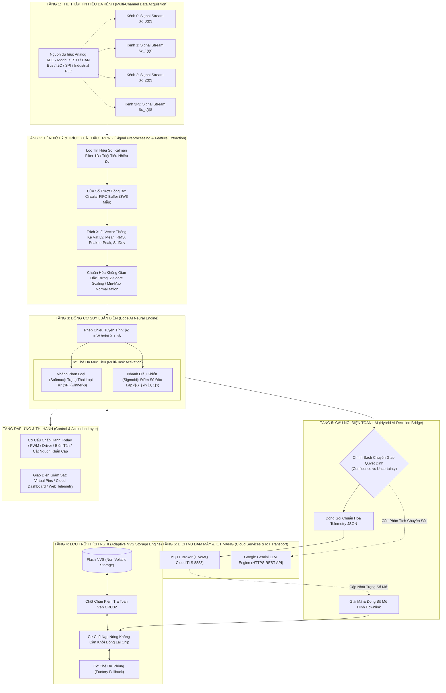

# AIoT_LIB: Enterprise-Grade Hybrid Edge-Cloud AI Framework

<p align="center">
  <b>Khung Phần Mềm AIoT Công Nghiệp Hiệu Năng Cao Cho Các Dòng Vi Điều Khiển ESP32 & Nền Tảng Điện Toán Lai (Hybrid Edge-Cloud Computing)</b>
</p>

<p align="center">
  
  
  
  
  
  
  
</p>

---

## Mục Lục

1. [Tổng Quan & Triết Lý Thiết Kế](#1-tổng-quan--triết-lý-thiết-kế)
2. [Kiến Trúc Hệ Thống Tổng Quát (System Architecture)](#2-kiến-trúc-hệ-thống-tổng-quát)
   - [Tầng 1: Thu Thập Tín Hiệu Đa Kênh (Data Acquisition Layer)](#tầng-1-thu-thập-tín-hiệu-đa-kênh-data-acquisition-layer)
   - [Tầng 2: Tiền Xử Lý & Trích Xuất Đặc Trưng (Signal Preprocessing & Feature Extraction)](#tầng-2-tiền-xử-lý--trích-xuất-đặc-trưng)
   - [Tầng 3: Động Cơ Suy Luận Biên Đa Nhiệm (Edge AI Neural Engine)](#tầng-3-động-cơ-suy-luận-biên-đa-nhiệm)
   - [Tầng 4: Bộ Nhớ Thích Nghi Flash NVS (Adaptive NVS Storage Engine)](#tầng-4-bộ-nhớ-thích-nghi-flash-nvs)
   - [Tầng 5: Cầu Nối Điện Toán Lai (Hybrid AI Decision Bridge)](#tầng-5-cầu-nối-điện-toán-lai)
   - [Tầng 6: Dịch Vụ Đám Mây & IoT Mạng (Cloud AI & IoT Transport)](#tầng-6-dịch-vụ-đám-mây--iot-mạng)
3. [Đặc Tính Kỹ Thuật & Hiệu Năng Thực Nghiệm (Benchmarks)](#3-đặc-tính-kỹ-thuật--hiệu-năng-thực-nghiệm)
4. [Cơ Sở Toán Học & Chốt Chặn Ổn Định Số Học](#4-cơ-sở-toán-học--chốt-chặn-ổn-định-số-học)
5. [Quy Chuẩn Giao Tiếp Dữ Liệu 2 Chiều (Universal Data Contracts)](#5-quy-chuẩn-giao-tiếp-dữ-liệu-2-chiều)
6. [Hướng Dẫn Khởi Động Nhanh (Quick Start)](#6-hướng-dẫn-khởi-động-nhanh)
7. [Hệ Thống Ví Dụ Thực Nghiệm (Examples Suite)](#7-hệ-thống-ví-dụ-thực-nghiệm)
8. [Cẩm Nang Tra Cứu API Chi Tiết (API Reference)](#8-cẩm-nang-tra-cứu-api-chi-tiết)

---

## 1. Tổng Quan & Triết Lý Thiết Kế

Trong các hệ thống điều khiển thông minh, giám sát công nghiệp và AIoT, việc triển khai trí tuệ nhân tạo luôn đối mặt với thế tiến thoái lưỡng nan:
* **Điện toán tại biên (Edge Computing):** Đạt tốc độ đáp ứng thời gian thực cực cao ($< 50\text{ }\mu\text{s}$), không phụ thuộc vào đường truyền mạng, nhưng bị hạn chế nghiêm trọng về dung lượng RAM/Flash và không thể xử lý suy luận ngữ nghĩa phức tạp.
* **Điện toán đám mây (Cloud Computing - Large Language Models):** Sở hữu năng lực phân tích sâu rộng, chẩn đoán lỗi ngữ nghĩa bằng ngôn ngữ tự nhiên, nhưng độ trễ cao ($1 - 3\text{ s}$) và có nguy cơ đứt gãy kết nối khi mất Internet.

**AIoT_LIB** được xây dựng nhằm giải quyết triệt để bài toán này dựa trên nền tảng **Hybrid AI v2.0** với các nguyên lý thiết kế:

> ### 1. Tách Rời Cơ Chế Khỏi Chính Sách (Separate Mechanism from Policy)
> Thư viện đóng vai trò là một động cơ nền tảng độc lập phần cứng: cung cấp trọn vẹn đường ống toán học, bộ đệm tín hiệu, mạng nơ-ron đa nhiệm, cơ chế lưu trữ Flash tự phục hồi và giao thức truyền thông an toàn. Toàn bộ logic ra quyết định (chính sách điều khiển, ngưỡng cảnh báo, kịch bản ứng phó) hoàn toàn thuộc quyền kiểm soát của kỹ sư ứng dụng.
>
> ### 2. Độc Lập Nguồn Tín Hiệu (Domain & Sensor Agnostic)
> Thư viện **không gắn chặt với bất kỳ loại cảm biến vật lý cụ thể nào**. Dù là tín hiệu điện áp từ ADC, dòng dữ liệu từ giao thức truyền thông công nghiệp (Modbus RTU/TCP, CAN bus, I2C, SPI), hay các vector thông số liên tục trong dây chuyền sản xuất, động cơ của `AIoT_LIB` đều tiếp nhận và xử lý theo mô hình chuỗi thời gian đa kênh tổng quát.
>
> ### 3. An Toàn Bộ Nhớ & Không Phân Bổ Động (Zero Dynamic Allocation during Inference)
> Mọi bộ đệm suy luận, mảng đặc trưng và vector trọng số đều được cấp phát bộ nhớ tĩnh (Static/Stack-guarded). Toàn bộ vòng lặp suy luận đạt **0 byte rò rỉ bộ nhớ (Zero Memory Leak)** qua các bài kiểm thử hàng ngàn chu kỳ liên tục.

---

## 2. Kiến Trúc Hệ Thống Tổng Quát

Kiến trúc thư viện được chuẩn hóa thành 6 phân tầng xử lý dữ liệu khép kín:


```mermaid
flowchart TD
    subgraph L1["TẦNG 1: THU THẬP TÍN HIỆU ĐA KÊNH (Multi-Channel Data Acquisition)"]
        direction LR
        CH0["Kênh 0: Signal Stream $x_0(t)$"]
        CH1["Kênh 1: Signal Stream $x_1(t)$"]
        CH2["Kênh 2: Signal Stream $x_2(t)$"]
        CHk["Kênh $k$: Signal Stream $x_k(t)$"]
        Sources["Nguồn dữ liệu: Analog ADC / Modbus RTU / CAN Bus / I2C / SPI / Industrial PLC"]
        Sources -.-> CH0 & CH1 & CH2 & CHk
    end

    subgraph L2["TẦNG 2: TIỀN XỬ LÝ & TRÍCH XUẤT ĐẶC TRƯNG (Signal Preprocessing & Feature Extraction)"]
        direction TB
        Filter["Lọc Tín Hiệu Số: Kalman Filter 1D / Triệt Tiêu Nhiễu Đo"]
        Window["Cửa Sổ Trượt Đồng Bộ: Circular FIFO Buffer ($W$ Mẫu)"]
        Extractor["Trích Xuất Vector Thống Kê Vật Lý: Mean, RMS, Peak-to-Peak, StdDev"]
        Scaler["Chuẩn Hóa Không Gian Đặc Trưng: Z-Score Scaling / Min-Max Normalization"]
        Filter --> Window --> Extractor --> Scaler
    end

    subgraph L3["TẦNG 3: ĐỘNG CƠ SUY LUẬN BIÊN (Edge AI Neural Engine)"]
        direction TB
        LinearMap["Phép Chiếu Tuyến Tính: $Z = W \cdot X + b$"]
        subgraph Heads["Cơ Chế Đa Mục Tiêu (Multi-Task Activation)"]
            SoftmaxHead["Nhánh Phân Loại (Softmax): Trạng Thái Loại Trừ ($P_{winner}$)"]
            SigmoidHead["Nhánh Điều Khiển (Sigmoid): Điểm Số Độc Lập ($S_j \in [0, 1]$)"]
        end
        LinearMap --> SoftmaxHead
        LinearMap --> SigmoidHead
    end

    subgraph L4["TẦNG 4: LƯU TRỮ THÍCH NGHI (Adaptive NVS Storage Engine)"]
        NVS_Flash[("Flash NVS (Non-Volatile Storage)")]
        CRC["Chốt Chặn Kiểm Tra Toàn Vẹn CRC32"]
        HotReload["Cơ Chế Nạp Nóng Không Cần Khởi Động Lại Chip"]
        Fallback["Cơ Chế Dự Phòng (Factory Fallback)"]
        NVS_Flash <--> CRC <--> HotReload <--> Fallback
    end

    subgraph L5["TẦNG 5: CẦU NỐI ĐIỆN TOÁN LAI (Hybrid AI Decision Bridge)"]
        direction TB
        DecisionGate{"Chính Sách Chuyển Giao Quyết Định<br/>(Confidence vs Uncertainty)"}
        Serializer["Đóng Gói Chuẩn Hóa Telemetry JSON"]
        Deserializer["Giải Mã & Đồng Bộ Mô Hình Downlink"]
        DecisionGate --> Serializer
        Deserializer --> HotReload
    end

    subgraph L6["TẦNG 6: DỊCH VỤ ĐÁM MÂY & IOT MẠNG (Cloud Services & IoT Transport)"]
        MQTT["MQTT Broker (HiveMQ Cloud TLS 8883)"]
        Gemini["Google Gemini LLM Engine (HTTPS REST API)"]
    end

    subgraph OUTPUT["TẦNG ĐÁP ỨNG & THI HÀNH (Control & Actuation Layer)"]
        Actuators["Cơ Cấu Chấp Hành: Relay / PWM / Driver / Biến Tần / Cắt Nguồn Khẩn Cấp"]
        Dashboard["Giao Diện Giám Sát: Virtual Pins / Cloud Dashboard / Web Telemetry"]
    end

    L1 --> L2
    L2 --> L3
    L3 <--> L4
    L3 --> OUTPUT
    L3 --> DecisionGate
    Serializer --> MQTT
    DecisionGate -.->|Cần Phân Tích Chuyên Sâu| Gemini
    MQTT -.->|Cập Nhật Trọng Số Mới| Deserializer
```

---

### Tầng 1: Thu Thập Tín Hiệu Đa Kênh (Data Acquisition Layer)
* Tiếp nhận từ **1 đến 4 kênh đầu vào độc lập** (có thể mở rộng linh hoạt theo cấu hình).
* Hoàn toàn độc lập với phần cứng: Cho phép kết nối trực tiếp chân Analog ADC vi điều khiển, hoặc nhận giá trị đo đọc về từ các bus công nghiệp như **Modbus RTU (RS485), CAN bus, I2C, SPI** hoặc các gói tin mạng.
* Mọi kênh tín hiệu được đồng bộ hóa thời gian lấy mẫu thông qua cơ chế non-blocking tick.

### Tầng 2: Tiền Xử Lý & Trích Xuất Đặc Trưng (Signal Preprocessing & Feature Extraction)
1. **Lọc trạng thái Kalman 1D:** Triệt tiêu nhiễu đo vật lý thời gian thực với ma trận hiệp phương sai sai số đo $R$ và hiệp phương sai nhiễu quá trình $Q$.
2. **Cửa sổ trượt đồng bộ (`CircularBuffer`):** Bộ đệm vòng cố định $W$ phần tử (16 - 32 mẫu) lưu trữ lịch sử chuỗi thời gian cho từng kênh với chi phí dịch mảng $O(1)$.
3. **Trích xuất đặc trưng thống kê thời gian:** Tính toán song song 4 chỉ số thống kê cơ bản trên mỗi kênh (tổng cộng 16 đặc trưng cho hệ 4 kênh):
   * **Giá trị trung bình ($\text{Mean}$):** Mức DC nền của tín hiệu.
   * **Giá trị hiệu dụng ($\text{RMS}$):** Năng lượng tổng thể của dao động.
   * **Biên độ đỉnh - đỉnh ($\text{Peak-to-Peak}$):** Biên độ cực đại của xung nhiễu.
   * **Độ lệch chuẩn ($\text{Standard Deviation}$):** Độ phân tán và biến động xung quanh giá trị trung bình.
4. **Chuẩn hóa không gian đặc trưng:** Hỗ trợ song song **Z-Score Normalization** ($z = \frac{x - \mu}{\sigma}$) và **Min-Max Scaling** ($x' = \frac{x - \min}{\max - \min}$), đi kèm chốt chặn bảo vệ chống chia cho 0.

### Tầng 3: Động Cơ Suy Luận Biên Đa Nhiệm (Edge AI Neural Engine)
* Động cơ mạng nơ-ron truyền thẳng (Feed-Forward) tính toán phép chiếu ma trận $Z = W \cdot X + b$.
* **Cơ chế đầu ra kép (Multi-Task Heads):**
  * **Phân loại trạng thái (Softmax Head):** Sinh phân phối xác suất trên $L$ trạng thái loại trừ lẫn nhau ($\sum P_i = 1$). Nhãn có xác suất cao nhất trở thành nhãn thắng cuộc ($\text{Winner Label}$).
  * **Điều khiển cơ cấu chấp hành (Sigmoid Head):** Sinh $C$ điểm số độc lập ($S_j \in [0.0, 1.0]$) cho từng kênh cơ cấu thi hành tương ứng, cho phép kích hoạt đồng thời nhiều lệnh độc lập.

### Tầng 4: Bộ Nhớ Thích Nghi Flash NVS (Adaptive NVS Storage Engine)
* Lưu trữ vĩnh viễn cấu hình trọng số ma trận $W$, bias $b$ và hệ số chuẩn hóa vào phân vùng Non-Volatile Storage (NVS Flash).
* **Mã băm kiểm tra tính toàn vẹn CRC32:** Phát hiện ngay lập tức tình trạng phân vùng Flash bị hỏng bit hoặc mất điện đột ngột trong lúc ghi.
* **Cơ chế nạp nóng (Hot-Reloading):** Cập nhật mô hình mới ngay trong lúc hệ thống đang vận hành mà không cần ngắt quãng hoặc khởi động lại chip.
* **Tự động phục hồi xuất xưởng (Factory Fallback):** Nếu dữ liệu Flash không vượt qua kiểm tra CRC32, hệ thống tự động quay về mô hình dự phòng tích hợp sẵn trong mã nguồn.

### Tầng 5: Cầu Nối Điện Toán Lai (Hybrid AI Decision Bridge)
* Đóng vai trò hạt nhân điều phối dòng dữ liệu hai chiều:
  * **Uplink (Biên $\rightarrow$ Mây):** Đóng gói toàn bộ vector đặc trưng, nhãn dự đoán, độ tự tin và thời gian thực thi thành bản tin Telemetry JSON chuẩn hóa.
  * **Downlink (Mây $\rightarrow$ Biên):** Tiếp nhận gói tin chứa mô hình cải tiến được huấn luyện từ đám mây, giải mã và nạp đè vào NVS Flash.
  * **Chẩn đoán phối hợp (Cloud Consultation):** Khi độ tự tin của Edge AI rơi xuống dưới ngưỡng an toàn (hoặc phát hiện trạng thái dị thường), hệ thống tự động chuyển giao gói dữ liệu thô cho mô hình ngôn ngữ lớn trên Cloud để phân tích nguyên nhân gốc rễ.

### Tầng 6: Dịch Vụ Đám Mây & IoT Mạng (Cloud AI & IoT Transport)
* **Giao tiếp MQTT an toàn:** Tích hợp giao thức truyền thông nhẹ chuẩn công nghiệp qua HiveMQ Cloud, bảo mật lớp vận chuyển TLS Port 8883.
* **Trí tuệ nhân tạo tạo sinh Google Gemini:** Gọi trực tiếp Google Gemini REST API qua HTTPS từ ESP32, cung cấp ngữ cảnh chẩn đoán kỹ thuật bằng ngôn ngữ tự nhiên.

---

## 3. Đặc Tính Kỹ Thuật & Hiệu Năng Thực Nghiệm

Toàn bộ các chỉ số dưới đây được đo lường thực tế trên phần cứng vi điều khiển **ESP32 Dev Module (Xtensa Dual-Core 240 MHz)** và kiểm thử tự động qua PlatformIO:

| Chỉ số kỹ thuật | Giá trị thực nghiệm | Ghi chú & Đánh giá |
| :--- | :--- | :--- |
| **Thời gian suy luận (Inference Latency)** | **$48\text{ }\mu\text{s}$** | Đo đạc qua timer phần cứng `micros()` (nhanh gấp 20.000 lần mạng) |
| **Mức chiếm dụng RAM tĩnh** | **54.7 KB** (~16.7% RAM) | Cực kỳ an toàn, còn trống hơn 270 KB cho tác vụ người dùng |
| **Mức chiếm dụng bộ nhớ Flash** | **928 KB** (~47.2% Flash) | Đã bao gồm WiFi, SSL/TLS, WebServer, DNS, FreeRTOS và AI Core |
| **Phân bổ bộ nhớ động trong suy luận** | **0 byte (Zero Heap Allocation)** | Hoàn toàn không xảy ra hiện tượng phân mảnh bộ nhớ (Memory Leak = 0) |
| **Tần số lấy mẫu tối đa hỗ trợ** | **$> 10\text{ kHz}$** | Đủ băng thông cho rung động cơ khí và chất lượng điện năng |
| **Số đặc trưng xử lý song song** | **16 đặc trưng** | 4 đặc trưng thời gian vật lý $\times$ 4 kênh tín hiệu đồng thời |
| **Cơ chế toàn vẹn dữ liệu** | **CRC-32 Hardware/Software** | Chống xung đột dữ liệu NVS khi sụt áp đột ngột |
| **Mức tiêu hao tài nguyên mạng** | **$\approx 250\text{ bytes/packet}$** | Tối ưu hóa chuỗi JSON cho băng thông thấp (NB-IoT/LTE-M ready) |

---

## 4. Cơ Sở Toán Học & Chốt Chặn Ổn Định Số Học

### 1. Thuật toán Lọc Kalman 1 chiều (1D Discrete Kalman Filter)
Quá trình cập nhật trạng thái ước lượng $\hat{x}_k$ và phương sai sai số $P_k$ được tối ưu hóa số học:
$$\text{Dự đoán:} \quad \hat{x}_k^- = \hat{x}_{k-1}, \quad P_k^- = P_{k-1} + Q$$
$$\text{Hiệu chỉnh:} \quad K_k = \frac{P_k^-}{P_k^- + R}, \quad \hat{x}_k = \hat{x}_k^- + K_k(z_k - \hat{x}_k^-), \quad P_k = (1 - K_k)P_k^-$$

### 2. Thuật toán Welford Trích Xuất Phương Sai Trực Tuyến
Thay vì tính toán 2 lượt qua mảng dữ liệu (dễ gây tràn số khi bình phương các số lớn), thư viện sử dụng thuật toán Welford cập nhật phương sai trực tuyến chỉ trong 1 lượt duyệt:
$$M_{1} = x_1, \quad S_{1} = 0$$
$$M_{k} = M_{k-1} + \frac{x_k - M_{k-1}}{k}, \quad S_k = S_{k-1} + (x_k - M_{k-1})(x_k - M_k)$$
$$\text{Variance} = \frac{S_N}{N}, \quad \text{StdDev} = \sqrt{\max(0.0f, \text{Variance})}$$

### 3. Các Chốt Chặn Ổn Định Số Học (Numerical Safety Guards)
* **Triệt tiêu phần tử không xác định (Sanitization):** Trước khi đưa dữ liệu vào bất kỳ phép tính toán nào, hệ thống kiểm tra qua macro `isnan()` và `isinf()`. Các mẫu bất thường tự động được thay thế bằng giá trị lịch sử gần nhất để chống sập chuỗi xử lý.
* **Bảo vệ căn bậc hai:** Đảm bảo đại lượng dưới dấu căn luôn không âm qua phép toán `\max(0.0f, \text{Var})`, ngăn ngừa lỗi phần cứng `NaN` phát sinh từ hàm `sqrtf()`.
* **Kẹp biên hàm kích hoạt Sigmoid (Clamped Sigmoid):**
  $$\sigma(z) = \frac{1}{1 + e^{-\text{clamp}(z, -40.0, +40.0)}}$$
  Ngăn chặn hoàn toàn hiện tượng tràn số mũ (`Floating point overflow/underflow`) khi giá trị đầu vào vượt quá ngưỡng biểu diễn của chuẩn IEEE 754.
* **Chống tràn số Softmax bằng phương pháp dịch cực đại (Max-Shifted Softmax):**
  $$P_i = \frac{e^{z_i - \max(Z)}}{\sum_{j=1}^L e^{z_j - \max(Z)} + \epsilon}, \quad \epsilon = 10^{-7}$$
  Đảm bảo lũy thừa cơ số tự nhiên không bao giờ vượt quá $e^0 = 1$, đồng thời loại bỏ nguy cơ chia cho 0 khi mẫu số triệt tiêu.

---

## 5. Quy Chuẩn Giao Tiếp Dữ Liệu 2 Chiều

### Bản tin Chiều Lên: Telemetry Uplink (Thiết bị $\rightarrow$ Máy chủ IoT / MQTT)
Được tự động cấu trúc bởi hàm `AIoT.hybridAI.serializeTelemetry()`:
```json
{
  "mac": "24:6F:28:XX:XX:XX",
  "winner_label": 0,
  "confidence": 0.945,
  "norm_type": "Z_SCORE",
  "from_nvs": true,
  "latency_us": 48,
  "cmd_scores": [0.82, 0.12, 0.0, 0.0],
  "features": [
    25.2, 26.4, 5.1, 1.3,
    10.1, 10.6, 2.1, 0.5,
    46.0, 46.2, 3.2, 0.8,
    52.0, 53.1, 6.2, 1.6
  ]
}
```

### Bản tin Chiều Xuống: Model Downlink (Máy chủ / Web $\rightarrow$ Thiết bị NVS)
Được phân tích cú pháp và nạp nóng tự động qua hàm `AIoT.hybridAI.syncModelFromJson()`:
```json
{
  "input_dim": 16,
  "num_labels": 3,
  "num_cmds": 2,
  "norm_type": 2,
  "W": [-0.52, -0.61, 0.12, 0.45, 0.88, -0.15],
  "b": [0.50, -0.20, -1.05, -0.60, -1.50],
  "norm1": [25.0, 26.0, 5.0, 1.2, 10.0, 10.5, 2.0, 0.5, 45.0, 46.0, 3.0, 0.8, 50.0, 52.0, 6.0, 1.5],
  "norm2": [4.5, 4.8, 1.5, 0.4, 2.0, 2.1, 0.6, 0.1, 3.0, 3.2, 0.9, 0.2, 5.0, 5.5, 1.2, 0.3]
}
```

---

## 6. Hướng Dẫn Khởi Động Nhanh

### Cài đặt qua PlatformIO (`platformio.ini`)
```ini
[env:esp32dev]
platform = espressif32
board = esp32dev
framework = arduino
monitor_speed = 115200
build_flags = 
    -ffunction-sections
    -fdata-sections
    -Wl,--gc-sections
```

### Ví dụ Vận Hành Tối Giản (Minimal Idiomatic Usage)
```cpp
#include <Arduino.h>
#include <AIoT.h>

void setup() {
    Serial.begin(115200);

    // 1. Khởi động mạng và giao thức IoT
    AIoT.begin("WIFI_SSID", "WIFI_PASSWORD", "device_01", "token_secret");

    // 2. Khởi tạo đường ống Edge AI: Cửa sổ 16 mẫu, 4 kênh đầu vào
    AIoT.edgeAI.begin(16, 4);

    // 3. Tự động phục hồi mô hình thích nghi từ NVS Flash (nếu có)
    if (!AIoT.edgeAI.loadFromNVS()) {
        Serial.println("Chay mo hinh mac dinh tu Flash ROM.");
    }
}

void loop() {
    // Duy trì các tác vụ nền của mạng
    AIoT.run();

    // Thu thập và nạp mẫu dữ liệu vào 4 kênh
    AIoT.edgeAI.push(0, analogRead(36));
    AIoT.edgeAI.push(1, analogRead(39));
    AIoT.edgeAI.push(2, analogRead(34));
    AIoT.edgeAI.push(3, analogRead(35));

    // Thực thi suy luận khi bộ đệm cửa sổ trượt đã tích lũy đủ mẫu
    if (AIoT.edgeAI.isReady()) {
        size_t state = AIoT.edgeAI.predict();
        float conf = AIoT.edgeAI.getWinnerConfidence();

        Serial.printf("Trang thai: %u | Do tin cay: %.2f | Thoi gian: %u us\n",
                      state, conf, AIoT.edgeAI.getExecutionTime());

        // Đẩy trạng thái về máy chủ qua Virtual Pin
        AIoT.updateTelemetry("ai_state", (int)state);
        AIoT.updateTelemetry("ai_conf", conf);
        AIoT.sendTelemetry();
    }

    delay(50);
}
```

---

## 7. Hệ Thống Ví Dụ Thực Nghiệm

Thư mục `examples/` cung cấp 5 kịch bản triển khai mẫu từ cơ bản đến phức tạp:

| Ví dụ | Đường dẫn file | Trọng tâm công nghệ |
| :--- | :--- | :--- |
| **01. Basic IoT** | [`01_Basic_IoT.ino`](examples/01_Basic_IoT/01_Basic_IoT.ino) | Kết nối mạng WiFi, Captive Portal cấu hình nội bộ, truyền thông dữ liệu Telemetry 2 chiều. |
| **02. Edge AI Pipeline** | [`02_Edge_AI_Pipeline.ino`](examples/02_Edge_AI_Pipeline/02_Edge_AI_Pipeline.ino) | Toàn trình thu thập 4 kênh, lọc Kalman, trích xuất 16 đặc trưng, chuẩn hóa Z-Score và phân loại trạng thái. |
| **03. Adaptive NVS** | [`03_Edge_AI_Adaptive_NVS.ino`](examples/03_Edge_AI_Adaptive_NVS/03_Edge_AI_Adaptive_NVS.ino) | Cơ chế khởi động 2 tầng (Flash NVS $\rightarrow$ Factory Fallback), phím lệnh kiểm thử Serial Monitor. |
| **04. Cloud AI Gemini** | [`04_Cloud_AI_Gemini.ino`](examples/04_Cloud_AI_Gemini/04_Cloud_AI_Gemini.ino) | Tích hợp Google Gemini HTTPS REST Client trực tiếp trên vi điều khiển, quản lý quota và DNS Fallback. |
| **05. Hybrid AI System** | [`05_Hybrid_AI_Full_System.ino`](examples/05_Hybrid_AI_Full_System/05_Hybrid_AI_Full_System.ino) | Phối hợp toàn diện Edge AI $\leftrightarrow$ Cloud AI: tự động chẩn đoán LLM khi độ tự tin thấp, đồng bộ mô hình mới qua MQTT. |

---

## 8. Cẩm Nang Tra Cứu API Chi Tiết

Mọi giao tiếp trong chương trình đều thông qua đối tượng duy nhất **`AIoT`**:

### Phân Hệ 1: Quản Trị Hệ Thống & Mạng IoT (`AIoT.*`)
```cpp
void begin(const char* ssid, const char* pass);
// Khởi tạo WiFi Station và mở WebServer Captive Portal cấu hình nếu mất mạng

void begin(const char* ssid, const char* pass, const char* mqttUser, const char* mqttPass);
// Khởi tạo WiFi kết hợp xác thực bảo mật kết nối MQTT HiveMQ TLS 8883

void run();
// Duy trì vòng lặp nền mạng, lắng nghe MQTT payload và kiểm tra sự kiện định kỳ (gọi trong loop)

bool CheckConnect();
// Trả về true nếu thiết bị đang kết nối WiFi thành công

void updateTelemetry(const char* key, const Param value);
// Cập nhật giá trị một trường dữ liệu telemetry vào hàng đợi xuất

void sendTelemetry();
// Đóng gói và đẩy ngay lập tức toàn bộ gói tin Telemetry lên máy chủ MQTT

int addTimeEvent(unsigned long intervalMs, void (*callback)());
// Đăng ký bộ đếm thời gian non-blocking gọi hàm callback định kỳ
```

### Phân Hệ 2: Động Cơ Suy Luận Edge AI (`AIoT.edgeAI.*`)
```cpp
void begin(size_t windowSize, size_t numChannels);
// Cấu hình kích thước cửa sổ trượt (W) và số kênh tín hiệu thu thập (1 - 4)

void setModel(const float* W, const float* b, size_t inputDim, size_t numLabels, size_t numCmds);
// Nạp bộ trọng số ma trận, vector bias và định hình số đầu ra

void setZScore(const float* mean, const float* stdDev);
// Thiết lập bộ tham số chuẩn hóa Z-Score cho không gian đặc trưng

void setNormalization(const float* minVals, const float* maxVals);
// Thiết lập bộ tham số chuẩn hóa Min-Max Scaling

float push(size_t channel, float rawSample);
// Lọc Kalman mẫu đo mới và nạp vào bộ đệm vòng của kênh chỉ định (trả về giá trị đã lọc)

bool isReady() const;
// Trả về true khi toàn bộ các kênh đã tích lũy đủ W mẫu trong cửa sổ trượt

size_t predict();
// Thực thi suy luận nơ-ron đa nhiệm (trả về chỉ số nhãn phân loại thắng cuộc)

float getWinnerConfidence() const;
// Trả về xác suất của nhãn thắng cuộc (chuẩn hóa Softmax, giá trị 0.0 đến 1.0)

float getCmdScore(size_t cmdIndex) const;
// Trả về điểm xác suất kích hoạt độc lập của kênh lệnh thứ cmdIndex (Sigmoid, 0.0 đến 1.0)

uint32_t getExecutionTime() const;
// Thời gian vi điều khiển thực thi toàn bộ quá trình tính toán và suy luận (micro-giây)

const float* getRawFeatures() const;
// Con trỏ tới mảng 16 giá trị đặc trưng thô vừa được trích xuất
```

### Phân Hệ 3: Quản Lý Lưu Trữ Flash NVS (`AIoT.edgeAI.*`)
```cpp
bool loadFromNVS();
// Đọc và kiểm tra mã CRC32 mô hình từ NVS Flash, tự động nạp nóng vào RAM nếu hợp lệ

bool saveCurrentToNVS();
// Băm mã CRC32 và ghi toàn bộ trọng số cùng hệ số chuẩn hóa hiện tại xuống NVS Flash

void clearNVS();
// Xóa trắng vùng nhớ mô hình trong NVS Flash (Khôi phục cài đặt gốc xuất xưởng)

bool isLoadedFromNVS() const;
// Trả về true nếu mô hình hiện tại đang chạy từ dữ liệu nạp bởi NVS Flash

const char* getNormTypeName() const;
// Trả về chuỗi định danh phương pháp chuẩn hóa ("Z_SCORE", "MIN_MAX", hoặc "NONE")
```

### Phân Hệ 4: Trí Tuệ Đám Mây Google Gemini (`AIoT.cloudAI.*`)
```cpp
void begin(const char* apiKey, const char* modelName = "gemini-1.5-flash");
// Cấu hình mã khóa API Key và chỉ định mô hình ngôn ngữ lớn sử dụng

String ask(const String& prompt, const String& systemInstruction = "");
// Gửi yêu cầu phân tích trực tiếp lên Google Gemini qua HTTPS và nhận phản hồi văn bản
```

### Phân Hệ 5: Cầu Nối Điện Toán Lai Hybrid AI (`AIoT.hybridAI.*`)
```cpp
String serializeTelemetry(const char* macAddress);
// Tự động đóng gói 16 đặc trưng, nhãn dự đoán, độ tự tin và thời gian thực thi thành chuỗi JSON

bool syncModelFromJson(const char* jsonPayload);
// Phân tích gói tin Downlink từ Cloud/Web, kiểm tra tính toàn vẹn và nạp nóng thẳng vào NVS Flash

String consultCloud(const String& queryContext);
// Tự động đính kèm 16 đặc trưng hiện tại vào câu lệnh truy vấn gửi Google Gemini chẩn đoán
```
